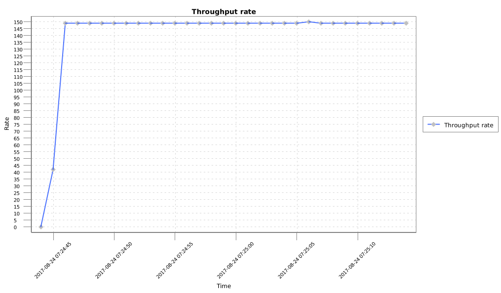

MPT Data Plotter: A Java library to plot Messaging Performance Test Tool Files
============


Introduction
----

This library reads compressed CSV files generated by the [Messaging Performance Test Tool](https://github.com/orpiske/msg-perf-tool/) and plot them. It makes it
easier to integrate processing of those files into custom automation tools without relying on Excel, GNUPlot or
GoogleCharts.
It can be used as a command-line tool or it can be integrated in other projects as a library.


Building
----

**Build Reports**

Build Status: [](https://travis-ci.org/orpiske/quiver-data-plotter)

Codacy Report: [](https://www.codacy.com/app/orpiske/quiver-data-plotter?utm_source=github.com&amp;utm_medium=referral&amp;utm_content=orpiske/quiver-data-plotter&amp;utm_campaign=Badge_Grade)

**Build Steps**

```
mvn clean install
```


Using as Command Line Tool
----

Run:

```
./mpt-data-plotter -f /path/to/file.csv.gz
```

Using as Library
----

**Dependencies**:

To use this project as library on your project you have to add my personal 
[bintray](https://bintray.com/orpiske/libs-release/) repository to the pom.xml
file:

```
<repositories>
    <repository>
        <id>orpiske-repo</id>
        <url>https://dl.bintray.com/orpiske/libs-release</url>
    </repository>
</repositories>
```

Then, the library can be referenced as: 
```
<dependency>
    <groupId>net.orpiske</groupId>
    <artifactId>mpt-data-plotter</artifactId>
    <version>1.0.1</version>
</dependency>
```

**Note**: replace version with the latest available version you wish to use.

**API**:

The API documentation (javadoc) is available [here](http://www.orpiske.net/files/javadoc/mpt-data-plotter-1/apidocs/). 
Additional project documentation is available [here](http://www.orpiske.net/files/javadoc/mpt-data-plotter-1/).

Sample usage:

```
RateDataProcessor rateDataProcessor = new RateDataProcessor();
RateReader rateReader = new RateReader(rateDataProcessor);

rateReader.read(fileName);

RateData rateData = rateDataProcessor.getRateData();


// Removes the gz
String baseName = FilenameUtils.removeExtension(fileName);
// Removes the csv
baseName = FilenameUtils.removeExtension(baseName);

// Plotter
RatePlotter plotter = new RatePlotter(baseName);
plotter.plot(rateData.getRatePeriods(), rateData.getRateValues());
```

Output
----

The MDP processing will generate 1 file per report: 

```
/path/to/receiverd-rate-0_rate.png
```

Deploying in Self-Maintained Maven Repository
----

If you maintain your own Maven repository, you can deploy this library using:

```
mvn deploy -DaltDeploymentRepository=libs-snapshot::default::http://hostname:8081/path/to/libs-snapshot-local
```

Samples
----
